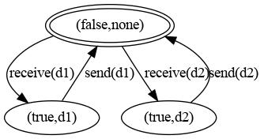
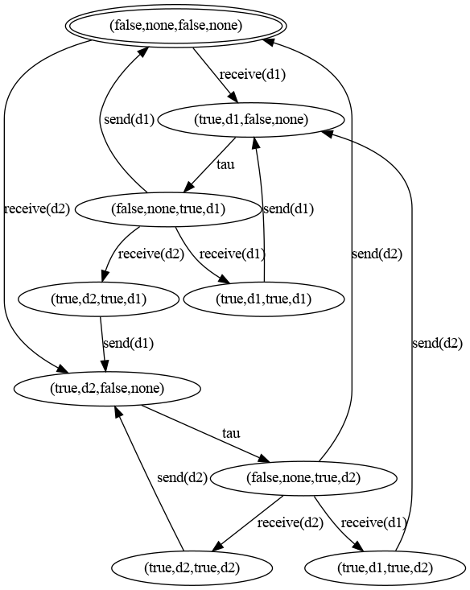
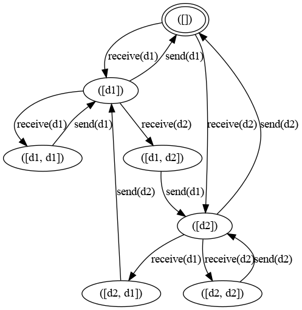

Buffers example.
===

Three variants of a simple buffer that reads from the environment by a `receive` action and writes to the environment by a `send` action. Both actions have a data parameter of sort `D` that contains the values `none | d1 | d2`.

- `buffer`: a one-place buffer, modelled as a process with two parameters:
  `full` (of sort `Bool`) to determine if the buffer contains a value; and
  `data` (of sort `D`) for the contents of the buffer.
  When the buffer is not full, the process reads an arbitrary value from the environment with action `receive` and stores it in the buffer.
  When the buffer is full, it sends the value in the buffer with action `send`.
- `buffers2` is a parallel composition of two one-place buffers, where the
  `send` action of the first buffer is renamed to `s1`, the `receive` action of the second buffer is renamed to `s2` and the actions `s1` and `s2` are synchronised to action `sync` (i.e., the multi-action `s1|s2` is renamed to `sync` and singleton actions `s1` and `s2` and other multi-actions are not allowed).
  This buffer behaves as a two-place buffer
- `listbuffer` is a two-place buffer implemented with a queue of sort `List(D)` as parameter.

The `./run.sh` command does the following:
- Linearise the examples to Liniar Process Specification (LPS) format
- Generate Labelled Transition Systems (LTSs) in the [mCRL2 LTS format](https://www.mcrl2.org/web/user_manual/tools/release/ltsconvert.html) and [Aldebaran .aut](https://cadp.inria.fr/man/aut.html) format
- Prints a summary of the generated LTSs using [ltsinfo](https://www.mcrl2.org/web/user_manual/tools/release/ltsinfo.html)
- Generates a Parameterised Booleand Equation System (PBES) to determine if `buffers2` and `listbuffer` are weakly bisimilar and solves the equation system. The answer is: yes, they are weakly bisimilar.

The single buffer has three states:

The `buffer2` and `listbuffer` processes are weakly bisimilar, i.e., they have
the same behaviour if `tau` actions (internal, unobservable) are discarded:
- `buffer2`:

  :

- `listbuffer`:

  
